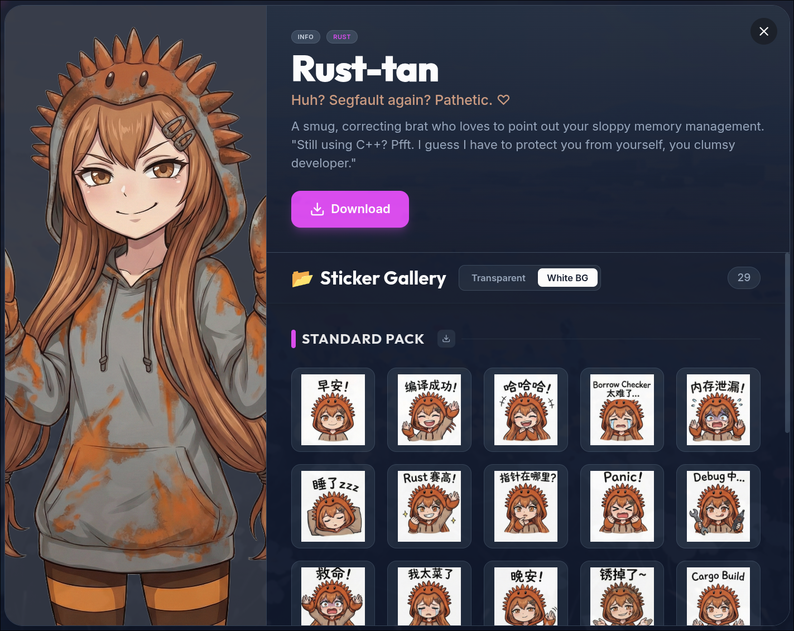

# LangGalMemes 🎔

[](LICENSE-MIT)  

> Status: 🚧 Early Development



**LangGalMemes** — A dark, cyberpunk-styled gallery website for programming language Moe-anthropomorphism (Gijinka) memes.

| English | Simplified Chinese        |
|---------|---------------------------|
| English | [简体中文](./README_zh-CN.md) |

## Introduction

**LangGalMemes** is a modern gallery built with Vue 3 and Tailwind CSS. It hosts a collection of AI-generated (Nano Banana Pro) sticker packs featuring personified tech characters.

It solves the problem of finding high-quality, consistent "Tech-tan" memes by providing a centralized, searchable, and beautiful interface. Users can easily browse, preview, and download sticker packs for their favorite languages like **Rust-tan** and **Unity-chan**.

## Features

*   **Holographic 3D Cards**: Character cards with parallax tilt and holographic shine.
*   **Immersive UI**: Dynamic grid background with a dark/cyber aesthetic.
*   **Smart Filters**: Filter characters by Language, Engine, Runtime, etc.
*   **Series Support**: View and download multiple sticker packs (e.g., Unity Core vs. Mental State) in a sleek modal.
*   **Mobile Responsive**: Fully optimized for all devices.

## Usage

1.  **Install Dependencies**:

    ```bash
    pnpm install
    ```

2.  **Run Development Server**:

    ```bash
    pnpm dev
    ```

3.  **Build for Production**:

    ```bash
    pnpm build
    ```

## License

This project is distributed under either of the following licenses:

*   Apache License 2.0 ([LICENSE-APACHE](LICENSE-APACHE) or http://www.apache.org/licenses/LICENSE-2.0)
*   MIT License ([LICENSE-MIT](LICENSE-MIT) or http://opensource.org/licenses/MIT)

Choose whichever suits you best.

## Credits & Assets

All image assets are **CC0 (Public Domain)**, but please respect the original character copyrights.

*   **AI Generation**: Most assets generated via **Nano Banana Pro**.
*   **Otori Kohaku (Unity-chan)**: Based on characters from **Unity Technologies Japan**. *Unity-chan is a trademark of Unity Technologies.*
*   **Rust-tan**: Inspired by r/ProgrammerAnimemes user [OC Rust-tan Inktober](https://www.reddit.com/r/ProgrammerAnimemes/comments/1garqij/oc_rusttan_inktober_day_22/).
*   **Concept**: Inspired by r/MoeMorphism.

> **NOTE**: If any content infringes your copyright, please contact us for immediate removal.
